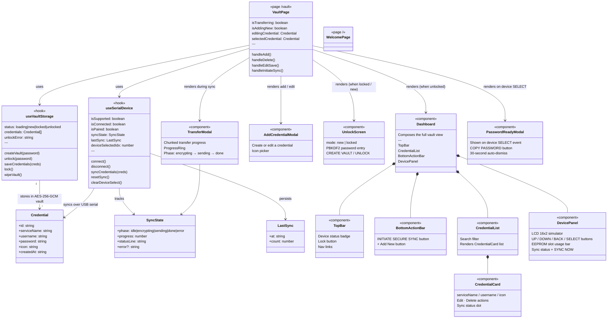
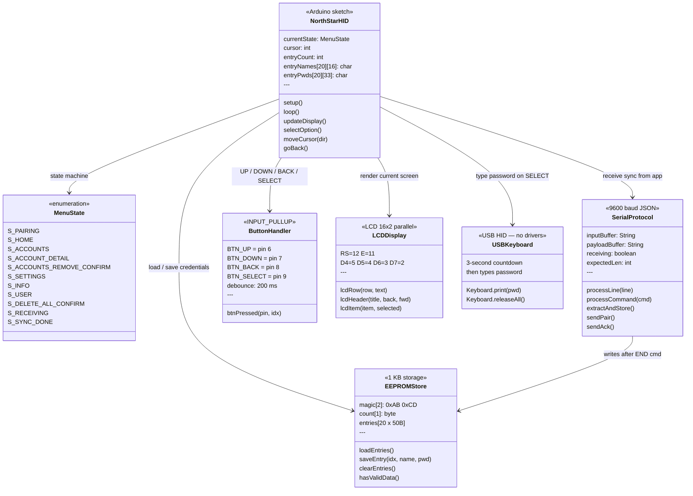

# NorthStar — Class Diagrams

Two diagrams: the **companion web app** and the **physical device firmware**.

---

## 1 — Companion Web App



---

## 2 — Physical Device Firmware (`northstar_hid.ino`)

Board: **Arduino Leonardo — ATmega32U4**



---

## How the two systems connect

```
Companion App (browser)          NorthStar Device (Leonardo)
────────────────────────         ──────────────────────────────
useSerialDevice hook       USB   SerialProtocol subsystem
  Web Serial API        ◄─────►  9600 baud JSON lines
  chunked 48-byte send            ACK each chunk
  syncCredentials()               extractAndStore() → EEPROM

                                 Standalone (no app needed):
                                  ButtonHandler → USBKeyboard
                                  plug into any PC, type pwd
```

| Sync command | Direction | Meaning |
|---|---|---|
| `{"event":"PAIR"}` | Device → App | Ready / announce |
| `{"cmd":"PAIR_ACK"}` | App → Device | Acknowledged |
| `{"cmd":"BEGIN","len":N}` | App → Device | Start transfer |
| `<48-byte chunk>` | App → Device | Payload chunk |
| `{"ack":1}` | Device → App | Chunk received |
| `{"cmd":"END"}` | App → Device | Write to EEPROM |
| `{"event":"SELECT","idx":N}` | Device → App | User picked account |
