# NorthStar Companion — Architecture Class Diagram

> Generated from source. All paths are relative to `src/`.

```mermaid
classDiagram

    %% ════════════════════════════════════════════════════════════
    %% DATA TYPES
    %% ════════════════════════════════════════════════════════════

    class Credential {
        <<interface>>
        +id: string
        +serviceName: string
        +username: string
        +password: string
        +icon: string
        +createdAt: string
    }

    class SyncPhase {
        <<enumeration>>
        idle
        encrypting
        sending
        done
        error
    }

    class SyncState {
        <<interface>>
        +phase: SyncPhase
        +progress: number
        +statusLine: string
        +error?: string
    }

    class LastSync {
        <<interface>>
        +at: string
        +count: number
    }

    class VaultStatus {
        <<enumeration>>
        loading
        new
        locked
        unlocked
    }

    class StoredVault {
        <<interface>>
        +salt: string
        +payload: string
    }

    class SessionData {
        <<interface>>
        +keyB64: string
        +expiresAt: number
    }

    %% ════════════════════════════════════════════════════════════
    %% BROWSER APIs  (external)
    %% ════════════════════════════════════════════════════════════

    class WebCryptoAPI {
        <<browser API>>
        +subtle.importKey()
        +subtle.deriveKey()
        +subtle.encrypt()
        +subtle.decrypt()
        +subtle.exportKey()
        +getRandomValues()
    }

    class WebSerialAPI {
        <<browser API>>
        +requestPort(filters)
        +getPorts()
        +open(baudRate)
        +close()
        +readable: ReadableStream
        +writable: WritableStream
    }

    class BrowserStorage {
        <<browser API>>
        +localStorage.getItem()
        +localStorage.setItem()
        +localStorage.removeItem()
        +sessionStorage.getItem()
        +sessionStorage.setItem()
        +sessionStorage.removeItem()
    }

    %% ════════════════════════════════════════════════════════════
    %% HOOKS
    %% ════════════════════════════════════════════════════════════

    class useVaultStorage {
        <<hook>>
        -keyRef: CryptoKey
        -saltRef: Uint8Array
        +status: VaultStatus
        +credentials: Credential[]
        +unlockError: string | null
        +createVault(password) void
        +unlock(password) void
        +saveCredentials(creds) void
        +lock() void
        +wipeVault() void
    }

    class useSerialDevice {
        <<hook>>
        -portRef: NSASerialPort
        -writerRef: WritableStreamDefaultWriter
        -msgQueueRef: Array
        +isSupported: boolean
        +isConnected: boolean
        +isPaired: boolean
        +syncState: SyncState
        +lastSync: LastSync | null
        +deviceSelectedIdx: number | null
        +connect() void
        +disconnect() void
        +syncCredentials(creds) void
        +resetSync() void
        +clearDeviceSelect() void
    }

    class useLCDSimulator {
        <<hook>>
        +screen: MenuScreen
        +cursor: number
        +line1: string
        +line2: string
        +canUp: boolean
        +canDown: boolean
        +canBack: boolean
        +canSelect: boolean
        +isTyping: boolean
        +pressUp() void
        +pressDown() void
        +pressBack() void
        +pressSelect() void
    }

    %% ════════════════════════════════════════════════════════════
    %% PAGES  (Next.js App Router)
    %% ════════════════════════════════════════════════════════════

    class WelcomePage {
        <<page>>
        route: /
    }

    class VaultPage {
        <<page>>
        route: /vault
        -isTransferring: boolean
        -isAddingNew: boolean
        -editingCredential: Credential | null
        -selectedCredential: Credential | null
        +handleAdd(cred) void
        +handleDelete(id) void
        +handleEditSave(cred) void
        +handleInitiateSync() void
    }

    class DevicePage {
        <<page>>
        route: /device
    }

    class SettingsPage {
        <<page>>
        route: /settings
    }

    class FAQPage {
        <<page>>
        route: /faq
    }

    %% ════════════════════════════════════════════════════════════
    %% LAYOUT COMPONENTS
    %% ════════════════════════════════════════════════════════════

    class Dashboard {
        <<component>>
        +credentials: Credential[]
        +isConnected: boolean
        +isPaired: boolean
        +isSupported: boolean
        +lastSync: LastSync | null
        +onInitiateSync() void
        +onAddNew() void
        +onEdit(id) void
        +onDelete(id) void
        +onConnect() void
        +onDisconnect() void
        +onLock() void
    }

    class TopBar {
        <<component>>
        +isConnected: boolean
        +isPaired: boolean
        +isSupported: boolean
        +onConnect() void
        +onDisconnect() void
        +onLock() void
    }

    class BottomActionBar {
        <<component>>
        +deviceConnected: boolean
        +devicePaired: boolean
        +onInitiateSync() void
        +onAddNew() void
    }

    class PageNav {
        <<component>>
    }

    %% ════════════════════════════════════════════════════════════
    %% VAULT COMPONENTS
    %% ════════════════════════════════════════════════════════════

    class CredentialList {
        <<component>>
        +credentials: Credential[]
        +lastSyncAt?: string
        +onEdit(id) void
        +onDelete(id) void
    }

    class CredentialCard {
        <<component>>
        +id: string
        +serviceName: string
        +username: string
        +icon: string
        +createdAt: string
        +lastSyncAt?: string
        +onEdit(id) void
        +onDelete(id) void
    }

    class AddCredentialModal {
        <<component>>
        +initialValues?: Partial~Credential~
        +onAdd(cred) void
        +onCancel() void
    }

    %% ════════════════════════════════════════════════════════════
    %% AUTH COMPONENTS
    %% ════════════════════════════════════════════════════════════

    class UnlockScreen {
        <<component>>
        +mode: new | locked
        +error: string | null
        +onSubmit(password) void
    }

    %% ════════════════════════════════════════════════════════════
    %% DEVICE COMPONENTS
    %% ════════════════════════════════════════════════════════════

    class DevicePanel {
        <<component>>
        +credentials: Credential[]
        +isConnected: boolean
        +isPaired: boolean
        +lastSync: LastSync | null
        +onConnect() void
        +onSync() void
    }

    class TransferModal {
        <<component>>
        +syncState: SyncState
        +onClose() void
    }

    class PasswordReadyModal {
        <<component>>
        +credential: Credential
        +onDismiss() void
    }

    %% ════════════════════════════════════════════════════════════
    %% UI COMPONENTS
    %% ════════════════════════════════════════════════════════════

    class ProgressRing {
        <<component>>
        +progress: number
    }

    %% ════════════════════════════════════════════════════════════
    %% PHYSICAL DEVICE FIRMWARE  (arduino/firmware/)
    %% ════════════════════════════════════════════════════════════

    class NorthStarHID {
        <<firmware — ATmega32U4>>
        board: Arduino Leonardo
        -entryNames: char[][]
        -entryPwds: char[][]
        -entryCount: int
        -currentState: MenuState
        -cursor: int
        +setup() void
        +loop() void
        +processLine(line) void
        +selectOption() void
        +moveCursor(dir) void
        +goBack() void
        +loadEntries() void
        +saveEntry(idx, name, pwd) void
        +clearEntries() void
        +sendPair() void
        +sendAck() void
        +Keyboard.print(pwd) void
    }

    class MenuState {
        <<enumeration>>
        S_PAIRING
        S_HOME
        S_ACCOUNTS
        S_ACCOUNT_DETAIL
        S_ACCOUNTS_REMOVE_CONFIRM
        S_SETTINGS
        S_INFO
        S_USER
        S_DELETE_ALL_CONFIRM
        S_RECEIVING
        S_SYNC_DONE
    }

    %% ════════════════════════════════════════════════════════════
    %% RELATIONSHIPS
    %% ════════════════════════════════════════════════════════════

    %% Type dependencies
    SyncState --> SyncPhase : phase is
    useVaultStorage --> VaultStatus : has status
    useVaultStorage --> StoredVault : serializes to/from
    useVaultStorage --> SessionData : caches key in
    useSerialDevice --> SyncState : tracks
    useSerialDevice --> LastSync : tracks

    %% Hook → Browser API
    useVaultStorage --> WebCryptoAPI : PBKDF2 + AES-256-GCM
    useVaultStorage --> BrowserStorage : vault + session
    useSerialDevice --> WebSerialAPI : USB serial port
    useSerialDevice --> BrowserStorage : persists lastSync

    %% Hook → Type
    useVaultStorage "1" --> "*" Credential : stores
    useSerialDevice --> Credential : syncs to device

    %% VaultPage — main orchestrator
    VaultPage --> useVaultStorage : uses
    VaultPage --> useSerialDevice : uses
    VaultPage --> Dashboard : renders
    VaultPage --> UnlockScreen : renders when locked/new
    VaultPage --> TransferModal : renders when syncing
    VaultPage --> AddCredentialModal : renders when adding/editing
    VaultPage --> PasswordReadyModal : renders on device SELECT

    %% Dashboard composition
    Dashboard *-- TopBar : contains
    Dashboard *-- CredentialList : contains
    Dashboard *-- BottomActionBar : contains
    Dashboard *-- DevicePanel : contains

    %% List → Card
    CredentialList "1" *-- "*" CredentialCard : renders

    %% DevicePanel internals
    DevicePanel --> useLCDSimulator : uses
    DevicePanel --> LastSync : reads
    DevicePanel --> Credential : displays

    %% TransferModal
    TransferModal --> SyncState : reads
    TransferModal --> ProgressRing : uses

    %% Firmware
    NorthStarHID --> MenuState : state machine
    NorthStarHID --> WebSerialAPI : USB CDC serial (host side)
    useSerialDevice --> NorthStarHID : protocol partner

    %% Device / Settings / FAQ pages use PageNav
    DevicePage --> PageNav : uses
    SettingsPage --> PageNav : uses
    FAQPage --> PageNav : uses
```



---

## Serial Protocol Summary (Web App ↔ Firmware)

```
Companion App                         NorthStar Device (Leonardo)
─────────────────────────────────────────────────────────────────
                         ← {"event":"PAIR"}        (on boot / REQUEST_KEY)
{"cmd":"PAIR_ACK"}       →
{"cmd":"BEGIN","count":N,"len":B} →
                         ← {"ack":1}
<48-byte JSON chunk>\n   →            (repeated per chunk)
                         ← {"ack":1}              (per chunk)
{"cmd":"END"}            →
                         ← {"ack":1}              (after EEPROM write)

During standalone use:
                         ← {"event":"SELECT","idx":N}   (user presses SELECT on device)
```

## EEPROM Layout (northstar_hid — 1 KB)

| Address | Size | Field |
|---------|------|-------|
| 0–1 | 2 B | Magic bytes `0xAB 0xCD` |
| 2 | 1 B | Entry count |
| 3 | 1 B | Reserved |
| 4 + (i × 50) | 50 B | Entry i: `[valid(1)][name(16)][pwd(33)]` |

Max 20 entries × 50 bytes = 1000 bytes ≤ 1 KB EEPROM.

## Key Files

| Path | Purpose |
|------|---------|
| `src/types/credential.ts` | `Credential` interface + icon options |
| `src/hooks/useVaultStorage.ts` | PBKDF2 key derivation, AES-256-GCM vault, session cache |
| `src/hooks/useSerialDevice.ts` | Web Serial API, chunked sync protocol, lastSync |
| `src/app/vault/page.tsx` | Main orchestrator — composes all hooks + modals |
| `src/components/layout/Dashboard.tsx` | Layout shell for the vault view |
| `src/components/device/DevicePanel.tsx` | LCD simulator + device status sidebar |
| `arduino/firmware/northstar_hid/northstar_hid.ino` | Leonardo HID firmware — types passwords |
| `arduino/firmware/northstar_device/northstar_device.ino` | Uno firmware — clipboard-mode variant |
